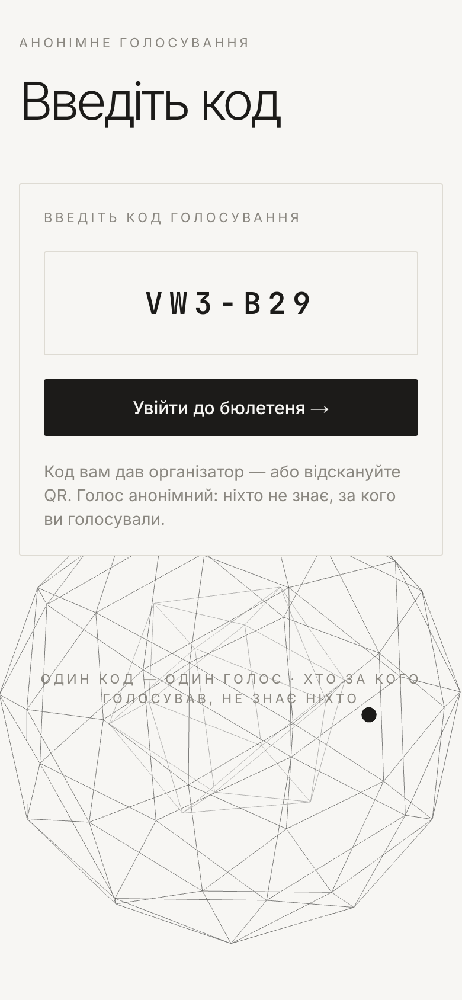
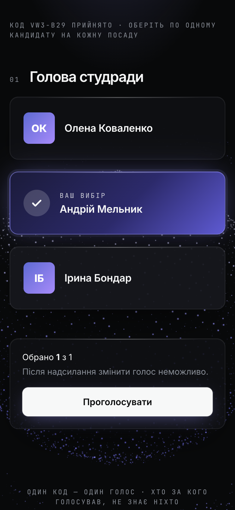
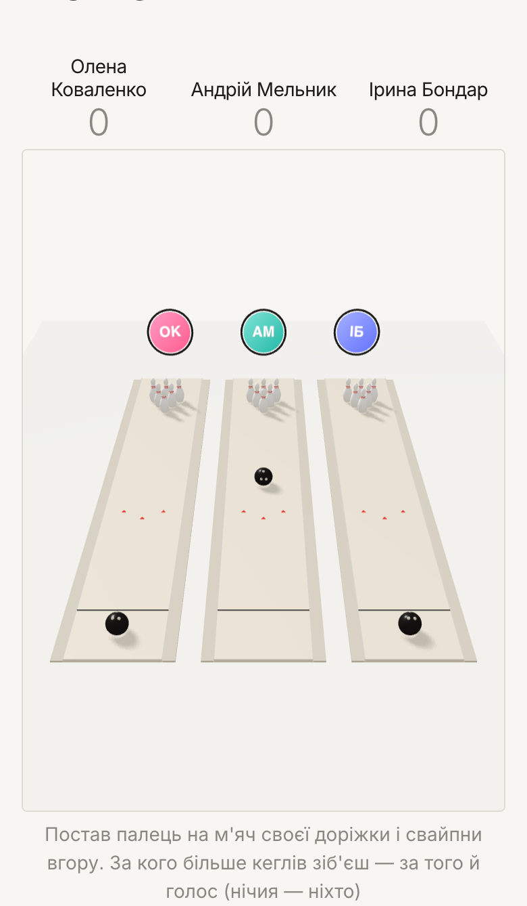
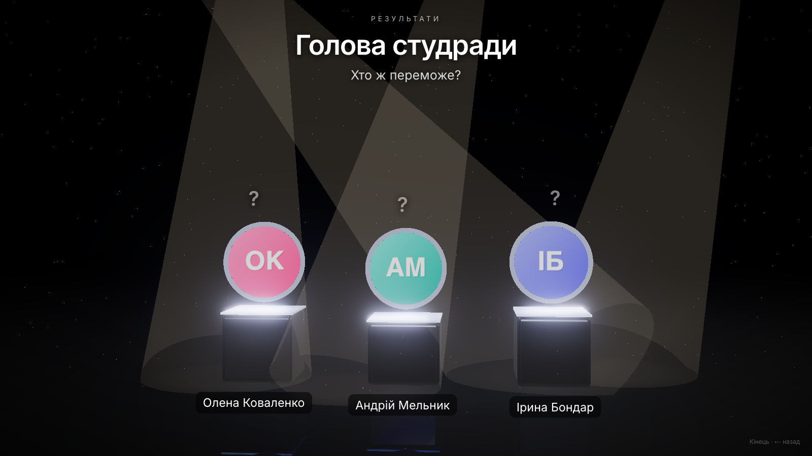
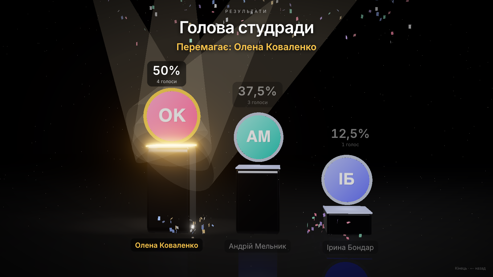
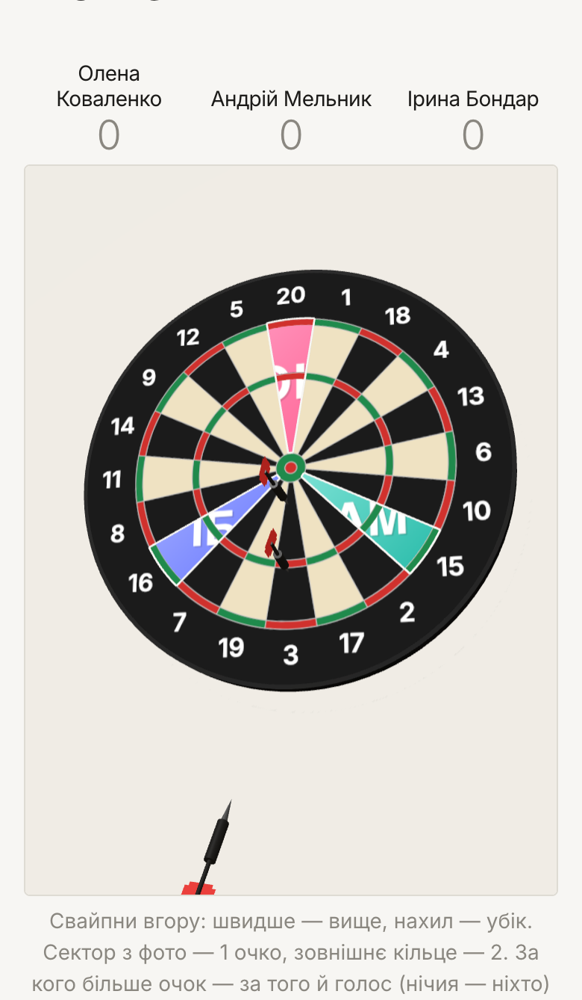
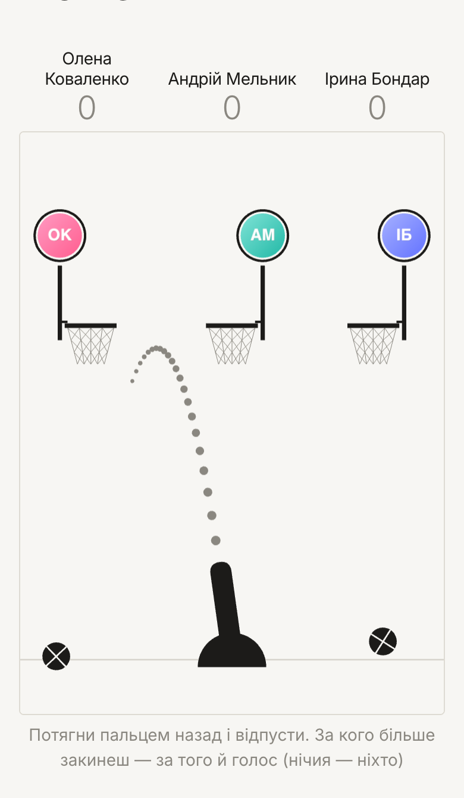

# Anonymous Voting

A web app for running anonymous elections at live events — student councils, clubs, meetups.
The organiser shows a QR code on the projector, people vote from their phones, and the results
are revealed on the big screen with an animated show.

**Live demo:** [anonymous-voting-rouge.vercel.app](https://anonymous-voting-rouge.vercel.app)
*(voting needs a code from the organiser)*

<p align="center">
  
  
  
</p>

## Features

**For voters**
- Join by scanning a QR code or typing a 6-character code — no sign-up.
- One ballot per browser per voting round; the choice can't be changed after it's cast.
- 22 visual themes with Three.js backgrounds — from minimal and Swiss to Y2K and comic.
- **Game themes** where the vote is chosen by playing: a cannon, basketball hoops, 3D bowling
  (swipe to throw) and darts. A hit — or, in the scoring games, the most hits — picks the
  candidate; the vote itself still needs a confirmation tap.
- Built mobile-first: touch aiming, stable layouts while the browser bars move, crisp rendering on high-DPI phones.

**For the organiser**
- Admin panel with any number of votings, each with its own code, QR, theme and lifecycle:
  `draft → open → closed → results`.
- Positions and candidates with photos (compressed in the browser before upload).
- Live results while voting is open (visible to the admin only).
- **Projector screen** — huge QR and code, live turnout and a "for fun" scoreboard of game hits.
- **Results show** — a cinematic 3D reveal: candidates race up on pedestals, the lead changes
  hands, then the winner breaks away with confetti and a synthesised fanfare. Driven step by
  step by the host (Space / clicker).

<p align="center">
  
  
</p>
<p align="center">
  
  
</p>
<p align="center">
  
  
</p>

## Privacy by design

- The database stores **only aggregate counts** per candidate — never who voted, when, or in what order.
- The "already voted" cookie holds only the voting round id, not the choice.
- Codes are random, unique per voting and can be rotated at any time (old QR codes stop working instantly).
- Admin session is a signed HMAC cookie; all admin actions re-check it on the server.

## Tech stack

| Area | Tools |
|---|---|
| Framework | Next.js 16 (App Router, Server Actions, Cache Components), React 19, TypeScript |
| Styling | Tailwind CSS v4, CSS custom properties per theme |
| 3D & motion | Three.js (custom scenes, physics, post-processing bloom), Web Animations API |
| Audio | Web Audio API (synthesised music, no audio files) |
| Data | PostgreSQL on Neon, Drizzle ORM |
| Hosting | Vercel |

## Architecture notes

- **Server-first.** Pages are Server Components; all writes go through Server Actions that validate
  input and re-check permissions. The client only gets what it needs to render.
- **Storage behind an interface.** `VotingStore` describes every operation; the Postgres
  implementation sits behind it, so the app logic doesn't depend on the database.
- **Live updates without heavy re-renders.** The projector polls a tiny JSON endpoint
  (~200 bytes) and animates the numbers in place; the page only re-renders when its title,
  theme, phase or code changes.
- **One engine, many games.** The cannon games share one physics/aiming engine; each theme
  only supplies its look (cannon, targets, projectiles, effects).
- **Game points are batched.** Phones send their game hits in small batches, not one request per hit.

## Getting started

Requirements: Node.js 20+, a PostgreSQL database (e.g. a free [Neon](https://neon.tech) project).

```bash
npm install
cp .env.example .env.local   # fill in the values
npm run db:push              # create the tables
npm run dev                  # http://localhost:3000
```

Environment variables (see `.env.example`):

| Variable | Purpose |
|---|---|
| `DATABASE_URL` | Postgres connection string (use the pooled one on Neon) |
| `ADMIN_EMAIL`, `ADMIN_PASSWORD` | Admin login |
| `SESSION_SECRET` | Signs the admin cookie — `openssl rand -base64 32` |
| `PUBLIC_URL` | Public address used in QR codes (optional locally) |

Open `/admin` to create a voting, add candidates, open it and share the QR.

## Project structure

```
src/
  app/            routes: voter page, admin, projector, results show, server actions
  components/     voting flow, admin panel, results, 3D stages and the game engine
  lib/            database client, store, queries, auth, codes, QR
  themes/         one folder per theme: CSS tokens + its 3D scene
  config/         tunable constants (codes, limits, visuals)
```

## How it was built

Designed and developed by me, with [Claude Code](https://claude.com/claude-code) as an AI pair-programmer.
